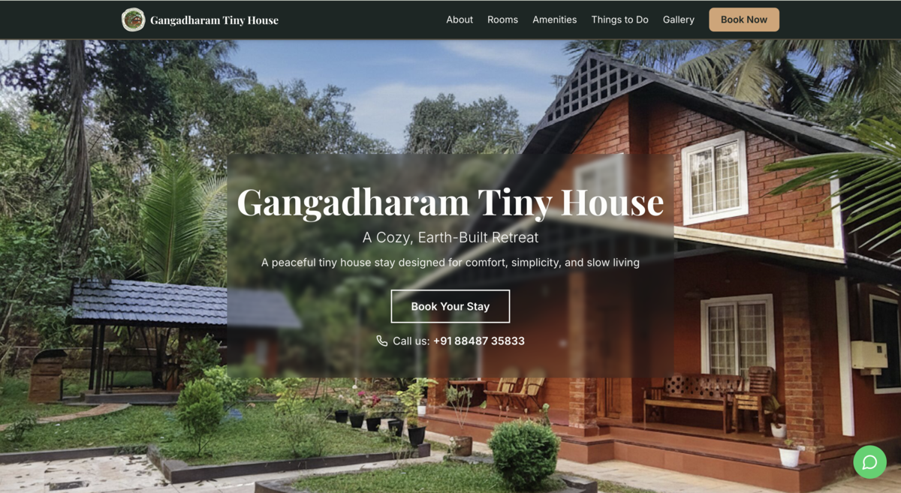
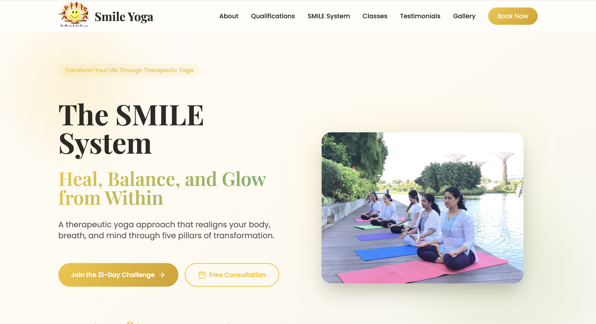

# AI-powered Websites Showcase

A public showcase of selected client-focused web projects delivered through Divlytics, combining AI-assisted workflows, cloud hosting, and practical problem-solving.

---

## Overview

These projects were built for real-world business use cases with a focus on simplicity, usability, and fast delivery. They also helped me explore how AI-assisted tools and streamlined workflows can reduce front-end delivery time, allowing more focus on system design, integrations, deployment, and user experience.

---

## Selected Projects

### Gangadharam Tiny House

Built and deployed a business website with a focus on performance and reliability.

This project used a high-availability static hosting architecture on AWS (S3, CloudFront, and Route 53), providing scalable hosting and fast content delivery. The front-end was rapidly prototyped using no-code tools and refined using AI-assisted coding with GitHub Copilot.

**Live site:** https://www.tinyhousekerala.com/

---

### Zyamadhari

Revamped an existing website and added lightweight business functionality.

Using AI-assisted tools, I introduced a workflow that allows users to browse products, add items to a cart, and send order details directly to the business owner via WhatsApp. This helped simplify the ordering process without requiring a full e-commerce setup.

**Live site:** https://www.zyamadhari.in/

---

### Smile Yoga

Helped a small business improve its online presence and communicate its credibility more clearly.

The website was structured to highlight certifications, experience, and testimonials, making it easier for potential clients to understand the value offered and build trust.

**Live site:** https://mridulasmileyoga.com/

---

## Tech & Approach

- AWS (S3, CloudFront, Route 53) for hosting and deployment where applicable
- AI-assisted development using GitHub Copilot and no-code tools
- Practical business-focused website delivery
- Focus on simplicity, performance, and usability
- Lightweight workflow enhancements for real-world use cases

---

## Notes

This repository is intended as a public showcase of selected projects. The production implementations were delivered for real clients and are maintained in private repositories.

If you’d like to discuss the implementation approach or technical decisions behind these projects, feel free to reach out:
- https://www.linkedin.com/in/kpdivya/